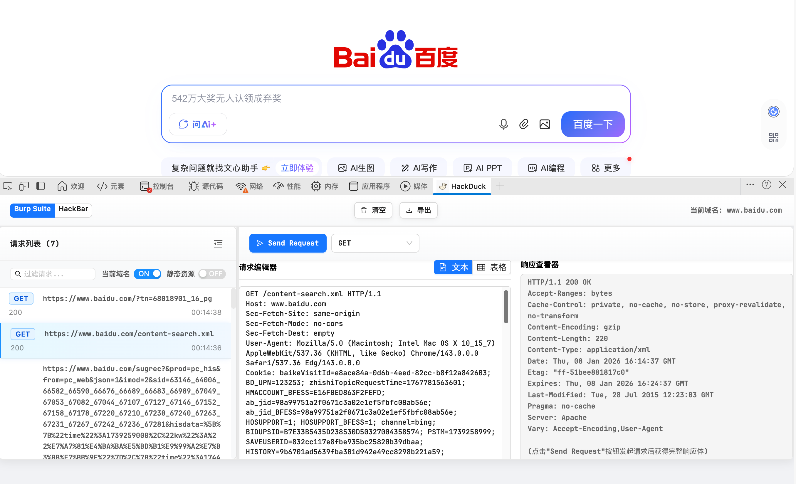
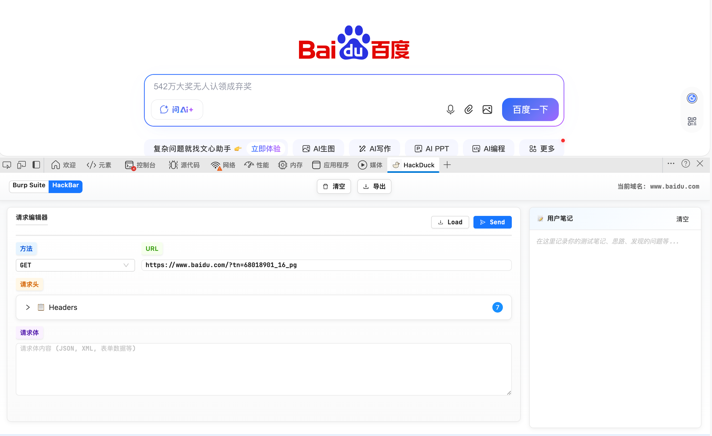
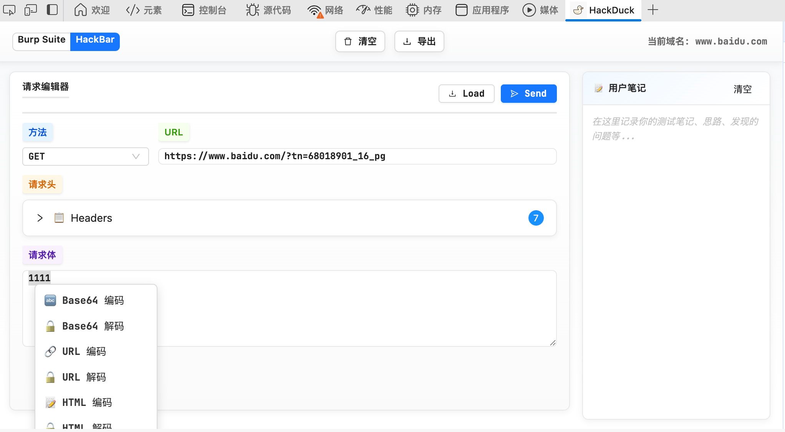

# HackDuck - HTTP Request Debugger

一个强大的浏览器扩展，用于 HTTP 请求的调试、拦截和修改。HackDuck 提供了两种工作模式：**Burp 模式**和 **HackBar 模式**，满足不同的使用场景。

## 功能特性

- 🔍 **实时请求拦截** - 捕获浏览器发出的所有 HTTP 请求
- ✏️ **请求编辑** - 修改请求头、参数、方法等
- 🚀 **请求重放** - 重新发送修改后的请求
- 📚 **请求历史** - 保存和管理请求记录
- 🔄 **批量操作** - 支持批量修改和发送
- 🌐 **多浏览器支持** - 兼容 Chrome、Edge、Firefox
- 🎨 **语法高亮** - 请求编辑器支持语法高亮和表格视图
- 📝 **用户笔记** - HackBar 模式支持用户笔记功能
- 🔐 **编码解码工具** - 右键菜单支持 Base64、URL、HTML 编码解码以及 MD5、SHA256 哈希

## 两种工作模式

### 🔧 Burp 模式

类似 Burp Suite 的请求拦截和编辑界面，适合批量查看和管理请求。

**主要功能：**

- 📋 请求列表：实时显示所有捕获的 HTTP 请求
- 🔍 请求过滤：支持按域名、静态资源过滤
- ✏️ 请求编辑器：支持文本视图和表格视图，语法高亮显示
- 📊 响应查看器：查看请求的响应头和响应体
- 🔄 请求重放：修改后重新发送请求



### ⚡ HackBar 模式

类似 HackBar 的快速请求编辑和发送界面，适合快速测试和调试。

**主要功能：**

- 🚀 快速编辑：简洁的界面，快速修改请求
- 📝 用户笔记：支持保存用户笔记，方便记录测试思路
- 🎯 当前页面请求：一键加载当前页面的请求
- 📤 快速发送：修改后立即发送请求



## 编码解码工具

HackDuck 提供了便捷的编码解码工具，可以在请求编辑器中直接使用。

### 使用方法

1. 在请求编辑器或响应查看器中，选中需要处理的文本
2. 右键点击选中的文本
3. 从右键菜单中选择相应的编码/解码操作

### 支持的功能

- **Base64 编码/解码** - 快速进行 Base64 编码和解码
- **URL 编码/解码** - URL 参数编码和解码
- **HTML 编码/解码** - HTML 实体编码和解码
- **MD5 哈希** - 计算文本的 MD5 哈希值
- **SHA256 哈希** - 计算文本的 SHA256 哈希值

### 特性

- ✨ **即时替换** - 编码/解码结果直接替换选中的文本
- 📝 **操作历史** - 支持撤销操作（Ctrl+Z）
- 🎯 **智能识别** - 自动识别文本区域，支持 textarea 和 input 元素



## 本地编译和安装

### 1. 克隆项目

```bash
git clone https://github.com/fxe00/hackduck.git
cd hackduck
```

### 2. 安装依赖

```bash
npm install
```

### 3. 编译项目

编译生产版本（用于安装到浏览器）：

```bash
npm run build
```

编译完成后，会在项目根目录生成 `dist` 文件夹，包含所有编译后的文件。

**开发模式（可选）：**

如果需要开发调试，可以使用开发模式，支持热重载：

```bash
npm run dev
```

### 4. 安装到浏览器

#### Chrome / Edge 浏览器

1. 打开浏览器，访问扩展管理页面：

   - Chrome: `chrome://extensions/`
   - Edge: `edge://extensions/`

2. 启用"开发者模式"（Developer mode）

   - 在页面右上角找到"开发者模式"开关，将其打开

3. 加载扩展

   - 点击"加载已解压的扩展程序"（Load unpacked）按钮
   - 选择项目的 `dist` 文件夹（**注意：是 dist 文件夹，不是项目根目录**）

4. 完成安装
   - 扩展加载成功后，会在扩展列表中显示
   - 打开浏览器开发者工具（F12），可以看到 "HackDuck" 标签页

#### Firefox 浏览器

**推荐方式：从 Firefox Add-ons 安装**

1. 访问 [Firefox Add-ons 页面](https://addons.mozilla.org/addon/hackduck-http-request-debugger/)
2. 点击"添加到 Firefox"（Add to Firefox）按钮
3. 确认安装权限
4. 安装完成后，打开浏览器开发者工具（F12），可以看到 "HackDuck" 标签页

**开发者安装方式（可选）：**

如果需要从源码安装：

1. 编译 Firefox 版本：

   ```bash
   npm run build
   bash scripts/build-firefox.sh
   ```

2. 打开 Firefox，访问 `about:debugging`

3. 点击"此 Firefox"（This Firefox）标签页

4. 点击"临时载入附加组件"（Load Temporary Add-on）按钮

5. 选择 `releases/dist-firefox` 目录中的 `manifest.json` 文件

6. 完成安装

### 5. 使用扩展

1. 打开浏览器开发者工具（F12）
2. 切换到 "HackDuck" 标签页
3. 选择工作模式：
   - **Burp 模式**：查看和管理所有捕获的请求
   - **HackBar 模式**：快速编辑和发送请求

## 开发说明

### 项目结构

```
hackduck/
├── src/
│   ├── components/      # Vue 组件
│   ├── core/           # 核心逻辑（background, content, injected）
│   ├── assets/         # 静态资源
│   └── styles.css      # 全局样式
├── dist/               # 编译输出目录（用于安装到浏览器）
├── images/             # 截图和图片资源
└── package.json        # 项目配置
```

### 构建命令

- `npm run build` - 构建生产版本（输出到 dist 目录）
- `npm run dev` - 开发模式，支持热重载
- `npm run package` - 构建并打包为 zip 文件

## 技术栈

- TypeScript
- WebExtensions API
- Webpack
- CSS3
- HTML5

## 浏览器兼容性

- ✅ Chrome 88+ - [从 Chrome Web Store 安装](https://chrome.google.com/webstore)（开发者模式加载 dist 目录）
- ✅ Edge 88+ - [从 Edge Add-ons 安装](https://microsoftedge.microsoft.com/addons)（开发者模式加载 dist 目录）
- ✅ Firefox 109+ - [从 Firefox Add-ons 安装](https://addons.mozilla.org/addon/hackduck-http-request-debugger/)

## 已知问题和限制

### 当前限制

1. **响应体获取限制**

   - 对于页面直接加载的资源（如 ``, `<script>`, `<link>` 等），由于浏览器安全限制，无法自动获取响应体
   - 需要通过点击"Send Request"按钮手动发送请求才能获取完整的响应体
   - 只有通过 JavaScript 发起的请求（fetch/XHR）才能自动捕获响应体

2. **CORS 限制**

   - 跨域请求可能受到 CORS 策略限制
   - 某些请求可能需要通过代理才能成功发送

3. **WebSocket 支持**
   - 目前仅支持捕获 WebSocket 握手请求，不支持完整的 WebSocket 消息拦截

### 未来计划

我们正在积极改进 HackDuck，计划在未来的版本中解决以下问题：

1. **响应体自动捕获优化**

   - 探索使用 Chrome DevTools Protocol (CDP) 来获取所有请求的响应体
   - 改进 injected script 的注入时机和覆盖范围
   - 支持更多类型的请求响应捕获

2. **功能扩展**

   - **Burp 模式增强**：
     - 支持请求/响应对比功能
     - 添加请求重放历史记录
     - 支持批量请求操作
     - 添加请求导出/导入功能
   - **HackBar 模式增强**：
     - 支持请求模板功能
     - 添加常用请求头预设
     - 支持请求历史记录
     - 增强用户笔记功能（支持 Markdown）

3. **性能和体验优化**

   - 优化大量请求时的性能
   - 改进 UI 响应速度
   - 添加更多自定义选项

4. **WebSocket 完整支持**
   - 支持 WebSocket 消息的实时拦截和编辑
   - 支持 WebSocket 连接管理

## 贡献和反馈

我们非常欢迎社区贡献和反馈！

### 反馈问题

如果你发现了 bug 或有功能建议，请通过以下方式反馈：

1. **提交 Issue**

   - 访问 [GitHub Issues](https://github.com/fxe00/hackduck/issues)
   - 点击 "New Issue" 创建新问题
   - 详细描述问题或建议，包括：
     - 问题描述
     - 复现步骤
     - 预期行为
     - 实际行为
     - 浏览器版本和扩展版本

2. **功能建议**
   - 欢迎提出新功能建议
   - 描述使用场景和预期效果

### 贡献代码

1. Fork 本项目
2. 创建特性分支 (`git checkout -b feature/AmazingFeature`)
3. 提交更改 (`git commit -m 'Add some AmazingFeature'`)
4. 推送到分支 (`git push origin feature/AmazingFeature`)
5. 开启 Pull Request

### 给项目点 Star ⭐

如果这个项目对你有帮助，欢迎给项目点个 Star！你的支持是我们持续改进的动力。

[](https://github.com/fxe00/hackduck)

## 许可证

MIT License
